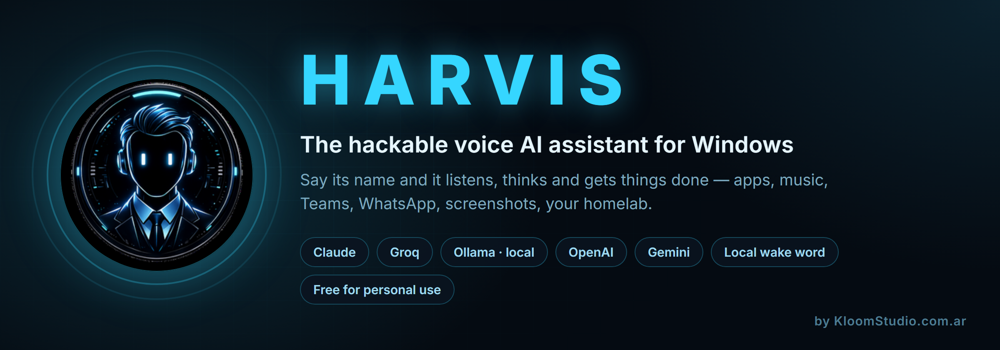

<p align="center">
  
</p>

<p align="center">
  <b>Your Windows PC. Controlled by voice. Powered by the AI you choose.</b><br>
  A hackable <b>voice AI assistant</b> for Windows — full source, free for
  personal use — by <a href="https://kloomstudio.com.ar">KloomStudio.com.ar</a>
</p>

<p align="center">
  
  
  
  
  
  <a href="https://t.me/+0tInup5bmYBiZjNh"></a>
  <a href="https://github.com/sponsors/Kloom89"></a>
</p>

<p align="center">
  <i>Free for personal use — <b>not for sale</b>. See <a href="#license--personal-use-not-for-sale">License</a>.</i>
</p>

<p align="center"><a href="README_ES.md">🇦🇷 Léelo en español</a></p>

---

<p align="center">
  
</p>

<p align="center"><sub>Real capture, no cuts: the command is spoken, HARVIS opens the player and checks the audio meter before saying it's playing.</sub></p>

Most AI assistants stop at conversation. **HARVIS keeps going.**

Say its name and it wakes up **on your machine** — no cloud microphone, no
push-to-talk. Then ask it to open an app, put on a playlist, read your Teams out
loud, draft a WhatsApp to a contact by name, look at a screenshot and explain the
error, or check the containers on your homelab over SSH.

**You pick the brain.** Claude, Groq, Ollama, OpenAI, Gemini, Kimi — HARVIS
handles the voice, the tools and the orchestration; your model does the
thinking.

**Need something it can't do yet?** Drop one Python file into `skills/` and it
learns a new trick. No SDK, no boilerplate.

<table align="center">
  <tr>
    <td align="center" valign="top">
      <br>
      <sub>The HUD: live chat, brain selector, skills, mic and abort</sub>
    </td>
    <td align="center" valign="top">
      <br>
      <sub>Idle, it's just a capsule that breathes while it listens.<br>
      Click it and the panel opens.</sub>
    </td>
  </tr>
</table>

## What it feels like

| You say | HARVIS does |
|---|---|
| *"Harvis"* | Wakes up, answers *"¿Señor?"*, keeps the mic open for your command |
| *"…what did they write me on Teams?"* | Reads the Teams desktop app and summarizes it out loud |
| *"…play my nightcore playlist and turn it down"* | Opens YouTube Music, hits play, checks the audio meter, lowers the volume |
| *"…tell Ana I'm running ten minutes late"* | Drafts the WhatsApp and **waits for your OK** before sending |
| *"…take a screenshot and tell me what this error is"* | Captures the screen, sends it to a vision model, explains the traceback |
| *"…is the homelab up?"* | SSHes in read-only and reports the containers |
| *"…switch the brain to groq"* | Same tools, different LLM, mid-conversation |
| **F9** | Shuts it up instantly and aborts the turn |

## Why HARVIS

**Your voice stays on your PC.** The wake word and the speech recognition are
local (Whisper). It even learns *your* voice: record six takes of you saying the
name and it matches on sound, so it still wakes up when the recognizer writes
"harley" or "javier". No always-on cloud microphone. Ever.

**It hears you over your own music.** Real echo cancellation (WebRTC + WASAPI
loopback, ~22 dB measured), so *"Harvis, next song"* works with the speakers
blasting.

**Use the AI you already like.** Claude, Groq, Ollama (local and free), OpenAI,
Gemini, Kimi — switch by voice or from the HUD, mid-conversation. Every model
gets the exact same tools, because tools never import a vendor SDK.

**It doesn't just answer.** Opens apps and windows, controls music and media,
reads Teams, drafts WhatsApp, sets timers, reads the screen with vision, checks
your homelab over SSH, searches your notes, and remembers things across
restarts.

**Modes that fit how you talk.** Follow-up window (Alexa-style), chat mode (no
wake word), dictation mode (talk, then paste anywhere), music mode (it notices
music is playing, only takes music commands and replies with a silent ✓ instead
of talking over the song) and coach mode.

**Extend it in minutes.** A new capability is one Python file in `skills/` —
tools, prompt context and background watchers included. Install it from the HUD
without restarting.

**Built to be debugged.** Every turn is traced to `turnos.jsonl`: command, brain,
each tool call with its duration, reply. Tools verify their own effect — it
checks the audio meter before claiming the music is playing. When it fails, you
find out why.

## Install (about two minutes)

```bat
git clone https://github.com/Kloom89/harvis
cd harvis
python -m venv .venv
.venv\Scripts\pip install -r requirements.txt
.venv\Scripts\python.exe doctor.py
kloom.cmd
```

Say **"Harvis"** — it answers, then you talk. Or click the capsule and type.

`doctor.py` is the preflight: it checks Python, the packages, your mic, the GPU
and which brains actually have credentials, and prints the exact command to fix
whatever is missing. **Run it first, and run it again whenever something
doesn't work.**

**Requirements:** Windows 11 · Python 3.12+ · a microphone · an NVIDIA GPU
recommended (Whisper large-v3; falls back to CPU/medium) · at least one LLM.

### Bring your own keys

HARVIS ships with **zero credentials** — every brain runs on *your* account, and
keys live in **environment variables, never in files** (the config only names
the variable, e.g. `api_key_env: GROQ_API_KEY`).

| Brain | Get a key | Set it |
|---|---|---|
| **Claude** (default) | [Claude Code / Agent SDK](https://claude.com/claude-code) — log in once with your own subscription or API key | handled by the SDK login |
| **Groq** (free tier, fastest) | [console.groq.com/keys](https://console.groq.com/keys) | `setx GROQ_API_KEY gsk_...` |
| **Ollama** (local, free, offline) | [ollama.com](https://ollama.com) — no key at all | — |
| **OpenAI** | [platform.openai.com](https://platform.openai.com/api-keys) | `setx OPENAI_API_KEY sk-...` |
| **Gemini** | [aistudio.google.com](https://aistudio.google.com/apikey) | `setx GEMINI_API_KEY ...` |
| **Kimi** | [platform.moonshot.ai](https://platform.moonshot.ai) | `setx MOONSHOT_API_KEY ...` |
| Telegram (optional) | [@BotFather](https://t.me/BotFather) | `setx TELEGRAM_BOT_TOKEN 123:abc` |

One brain is enough to start. **Groq's free tier or a local Ollama cost you
nothing.** A brain without its key simply fails to connect and HARVIS says so;
the others keep working.

### Teach it your voice (2 minutes, worth it)

```bat
.venv\Scripts\python.exe grabar_harvis.py
```

Six takes of you saying the wake word. It auto-calibrates a threshold, and from
then on the wake word also matches acoustically — so it still wakes up when the
speech recognizer writes "harley", "harvest" or "javier".

## More than the mic

- **Telegram** — talk to it from your phone, by text *or* voice note. Single-owner pairing.
- **Proactive** — morning briefing (weather + pending + Teams), nightly
  self-reflection where it updates its own memory of you, watchers that warn you
  when a container dies.
- **Auto-updates** — it checks the repo daily; say *"update yourself"* and it
  pulls, installs dependencies and restarts itself.
- **Rename it** — HARVIS is just the default. From the HUD you can change the
  wake word to anything, in any language, and the whole app renames itself.

> The HUD shows a small rotating banner with other
> [KloomStudio](https://kloomstudio.com.ar) apps — that's how the free version
> pays for itself. Leaving it on is how you say thanks 😉

## Write a skill

One Python file in `skills/`. Full guide: **[SKILLS.md](SKILLS.md)**.

```python
"""My skill: what it does (this first line shows in the HUD)."""
from registry import kloom_tool

PROMPT = "Context the LLM gets about this skill."

@kloom_tool("my_tool", "What the LLM reads to decide when to call it.",
            {"param": str, "optional": (str, "default")})
async def my_tool(args):
    return "result the assistant speaks"

TOOLS = [my_tool]

async def WATCHER(avisar, cfg):     # optional: background loop
    ...
    await avisar("Sir, something happened.")
```

Install it from the HUD (**⚙ AJUSTES → Skills instaladas → ＋ Install skill**) — it hot-reloads, no
restart. **Pull requests with new skills are very welcome**; that's the whole
point of publishing this.

## Community

Questions, a skill you built, a bug you can't pin down, or just showing what you
made it do — there's a Telegram group:

<p align="center">
  <a href="https://t.me/+0tInup5bmYBiZjNh"><b>📣 Join KloomCommunity on Telegram</b></a>
</p>

Bugs and feature requests are better as
[issues](https://github.com/Kloom89/harvis/issues) — they stay searchable for
whoever hits the same thing next.

## Under the hood

```
oido.py      mic, VAD, push-to-talk, self-healing audio stream
eco.py       WebRTC echo cancellation (WASAPI loopback reference)
stt.py       faster-whisper + anti-hallucination filters + wake protections
huella.py    acoustic wake-word fingerprint (MFCC + DTW, zero deps)
kloom.py     orchestrator: wake → modes → brain → voice
cerebro.py   brain factory + Claude Agent SDK driver
cerebro_jarvis.py  OpenAI-compatible driver (Groq/Ollama/OpenAI/Gemini/Kimi)
registry.py  canonical Tool format — tools never import a vendor SDK
boca.py      streaming Edge-TTS pipeline (it speaks while still thinking)
hud.py       pywebview floating HUD
skills/      community-extensible skills (tools + prompt + watchers)
tools/       built-in toolset
trazas.py    per-turn observability (turnos.jsonl)
```

Everything is configurable in [`config.yaml`](config.yaml): wake word and
aliases, VAD timings, TTS voice, brains and models, briefing hour, and per-tool
settings (SSH host, vault path, projects dir — leave one empty and that tool
politely disables itself).

## Privacy

- Everything runs on **your** machine. **Audio never leaves your PC** — Whisper
  is local. Only the text of your commands goes to the LLM you chose.
- One click on the capsule mutes the microphone completely (privacy mode).
- `log_all_speech` and `save_wake_audio` are **off** by default.
- Your voice fingerprint (`dataset/`) and every runtime log are gitignored.

## Language

HARVIS ships **bilingual — Spanish and English**, switched from the HUD
(**⚙ AJUSTES → Idioma / Language**), live, no restart. That one setting drives
everything: the interface, the language Whisper transcribes in, and the language
the brain answers in. It never guesses the language from your speech — set it to
English and it answers in English even if you ask in Spanish.

The wake word, the command phrasings and the voices live in `config.yaml`.
Adding a third language is one entry in the HUD's `I18N` table plus a voice —
PRs welcome.

## Sponsors

HARVIS is free and stays free. Sponsoring is what buys the hours that go into
it: new skills, fewer rough edges, and answering the people who show up with
issues.

<p align="center">
  <a href="https://github.com/sponsors/Kloom89"></a>
</p>

There's also a **[skill store](https://kloom89.github.io/harvis/)** — paid
skills that don't ship with HARVIS, installable in one click from the HUD.

Sponsors get their name in this section and their issues looked at first.

**Using HARVIS for work?** The standard license doesn't cover that. The
$50/month tier licenses commercial use on your own machine; $250 and $1,000
cover a team (see [License](#license--personal-use-not-for-sale)).

*No sponsors yet. Yours would be the first one here.*

## License — personal use, not for sale

HARVIS is released under the
[PolyForm Noncommercial 1.0.0](LICENSE) license. The full source is here and
you can do almost anything with it — but to be precise, that's a
*source-available* license, not an OSI-approved open-source one.

**You can** use it, modify it, fork it, publish your skills and share it with
whoever you want, for personal projects.

**You cannot** sell HARVIS, or sell a product or service built on it, without
permission. Want a commercial license?
Write to [KloomStudio](https://kloomstudio.com.ar).

© 2026 KloomStudio · [kloomstudio.com.ar](https://kloomstudio.com.ar)

If HARVIS saved you time, give the repo a ⭐. If you built something
interesting with it, open an issue and show us.

---

<p align="center">
  <b><a href="README_ES.md">🇦🇷 Léelo en español →</a></b><br>
  <sub>Mismo README, completo, en castellano.</sub>
</p>
