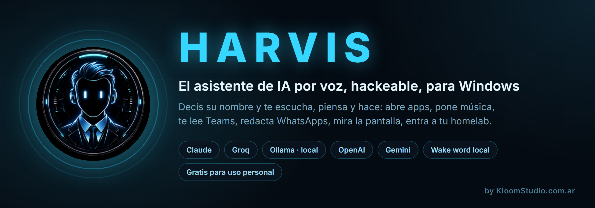
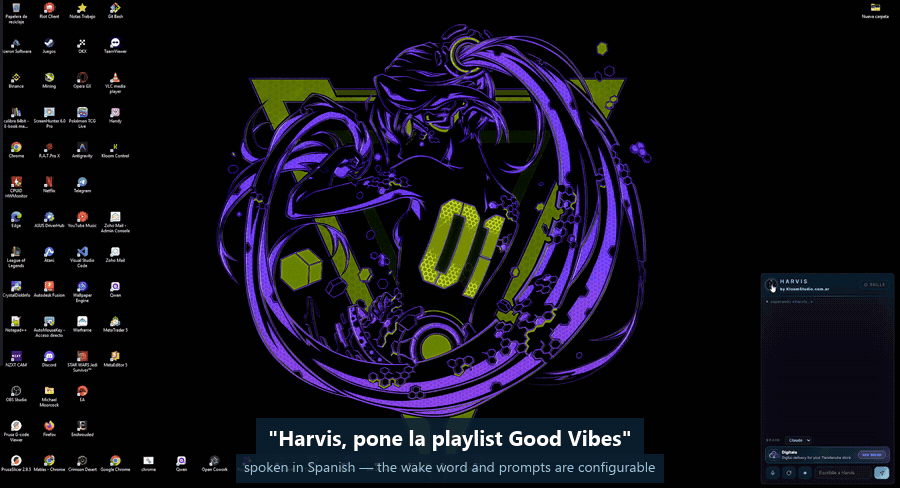
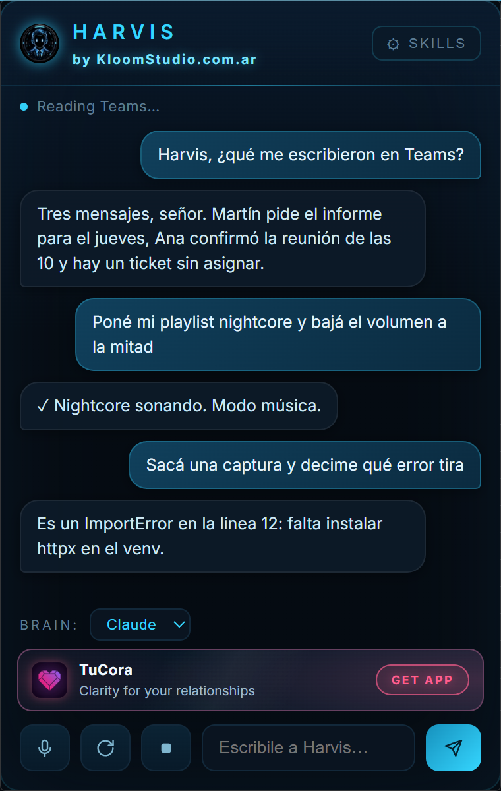
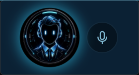

<p align="center">
  
</p>

<p align="center">
  <b>Tu PC con Windows. Manejada por voz. Con la IA que vos elijas.</b><br>
  Un <b>asistente de IA por voz</b> hackeable para Windows — todo el código a la
  vista, gratis para uso personal — por
  <a href="https://kloomstudio.com.ar">KloomStudio.com.ar</a>
</p>

<p align="center">
  
  
  
  
  
  <a href="https://t.me/+0tInup5bmYBiZjNh"></a>
  <a href="https://github.com/sponsors/Kloom89"></a>
</p>

<p align="center">
  <i>Gratis para uso personal — <b>no se vende</b>. Mirá la <a href="#licencia--uso-personal-no-se-vende">licencia</a>.</i>
</p>

<p align="center"><a href="README.md">🇬🇧 Read this in English</a></p>

---

<p align="center">
  
</p>

<p align="center"><sub>Captura real, sin cortes: la orden se dice hablando, HARVIS abre el reproductor y mira el medidor de audio antes de decir que suena.</sub></p>

La mayoría de los asistentes de IA se quedan en la charla. **HARVIS sigue de largo.**

Decís su nombre y se despierta **en tu máquina** — sin micrófono en la nube, sin
apretar nada. Después pedile que abra una app, que ponga una playlist, que te
lea Teams en voz alta, que redacte un WhatsApp a un contacto por nombre, que
mire una captura y te explique el error, o que revise los contenedores de tu
homelab por SSH.

**El cerebro lo elegís vos.** Claude, Groq, Ollama, OpenAI, Gemini, Kimi —
HARVIS pone la voz, las herramientas y la orquestación; tu modelo pone el
pensamiento.

**¿Le falta algo?** Tirás un archivo `.py` en `skills/` y aprende una capacidad
nueva. Sin SDK, sin código de relleno.

<table align="center">
  <tr>
    <td align="center" valign="top">
      <br>
      <sub>El HUD: chat en vivo, selector de cerebro, skills, micrófono y cortala</sub>
    </td>
    <td align="center" valign="top">
      <br>
      <sub>En reposo es una cápsula que respira mientras te escucha.<br>
      Le hacés clic y se abre el panel.</sub>
    </td>
  </tr>
</table>

## Cómo se siente usarlo

| Vos decís | HARVIS hace |
|---|---|
| *"Harvis"* | Se despierta, contesta *"¿Señor?"* y deja el micrófono abierto para tu orden |
| *"…¿qué me escribieron en Teams?"* | Lee la app de escritorio de Teams y te lo resume en voz alta |
| *"…poné mi playlist de nightcore y bajá el volumen"* | Abre YouTube Music, le da al play, verifica que suene y baja el volumen |
| *"…decile a Ana que llego diez minutos tarde"* | Redacta el WhatsApp y **espera tu OK** antes de mandarlo |
| *"…sacá una captura y decime qué error tira"* | Captura la pantalla, se la manda a un modelo con visión y te explica el traceback |
| *"…¿está levantado el homelab?"* | Entra por SSH en modo lectura y te reporta los contenedores |
| *"…cambiá el cerebro a groq"* | Las mismas herramientas, otro modelo, en medio de la charla |
| **F9** | Lo calla al instante y aborta el turno |

## Por qué HARVIS

**Tu voz no sale de tu PC.** El wake word y el reconocimiento de voz son
locales (Whisper). Encima aprende *tu* voz: grabás seis tomas diciendo el
nombre y te reconoce por sonido, así que se despierta igual cuando el
reconocedor escribe "harley" o "javier". Nada de micrófono en la nube siempre
prendido. Nunca.

**Te escucha con la música puesta.** Cancelación de eco de verdad (WebRTC +
loopback WASAPI, ~22 dB medidos), así que *"Harvis, pasá de tema"* funciona con
los parlantes a full.

**Usá la IA que ya te gusta.** Claude, Groq, Ollama (local y gratis), OpenAI,
Gemini, Kimi — se cambia por voz o desde el HUD, en medio de la conversación.
Todos los modelos reciben exactamente las mismas herramientas, porque las
herramientas nunca importan el SDK de un proveedor.

**No se queda en contestar.** Abre apps y ventanas, maneja música y multimedia,
lee Teams, redacta WhatsApps, pone timers, mira la pantalla con visión, revisa
tu homelab por SSH, busca en tus notas y se acuerda de las cosas entre
reinicios.

**Modos que se adaptan a cómo hablás.** Ventana de seguimiento (estilo Alexa),
modo charla (sin wake word), modo redactor (dictás y después pegás donde
quieras), modo música (se da cuenta de que hay música sonando, solo acepta
órdenes de música y responde con un ✓ silencioso en vez de hablarte encima del
tema) y modo coach.

**Se extiende en minutos.** Una capacidad nueva es un solo archivo Python en
`skills/` — con sus herramientas, su contexto para el modelo y sus vigías de
fondo. Se instala desde el HUD sin reiniciar nada.

**Pensado para debuggear.** Cada turno queda trazado en `turnos.jsonl`: la
orden, el cerebro, cada herramienta con su duración, la respuesta. Las
herramientas verifican su propio efecto — mira el medidor de audio antes de
decirte que la música está sonando. Cuando algo falla, te enterás de por qué.

## Instalar (dos minutos)

```bat
git clone https://github.com/Kloom89/harvis
cd harvis
python -m venv .venv
.venv\Scripts\pip install -r requirements.txt
.venv\Scripts\python.exe doctor.py
kloom.cmd
```

Decí **"Harvis"** — te contesta y ahí hablás. O le hacés clic a la cápsula y
escribís.

`doctor.py` es el chequeo previo: mira Python, los paquetes, el micrófono, la
GPU y cuáles cerebros tienen credencial de verdad, y te imprime el comando
exacto para arreglar lo que falte. **Corrélo antes de arrancar, y de nuevo cada
vez que algo no ande.**

**Requisitos:** Windows 11 · Python 3.12+ · un micrófono · GPU NVIDIA
recomendada (Whisper large-v3; si no hay, cae a CPU/medium) · por lo menos un
modelo de IA.

### Poné tus propias keys

HARVIS viene **sin ninguna credencial** — cada cerebro corre con *tu* cuenta, y
las keys viven en **variables de entorno, nunca en archivos** (la config solo
nombra la variable, por ejemplo `api_key_env: GROQ_API_KEY`).

| Cerebro | Dónde sacar la key | Cómo se pone |
|---|---|---|
| **Claude** (por defecto) | [Claude Code / Agent SDK](https://claude.com/claude-code) — entrás una vez con tu suscripción o tu API key | lo maneja el login del SDK |
| **Groq** (gratis, el más rápido) | [console.groq.com/keys](https://console.groq.com/keys) | `setx GROQ_API_KEY gsk_...` |
| **Ollama** (local, gratis, offline) | [ollama.com](https://ollama.com) — no lleva key | — |
| **OpenAI** | [platform.openai.com](https://platform.openai.com/api-keys) | `setx OPENAI_API_KEY sk-...` |
| **Gemini** | [aistudio.google.com](https://aistudio.google.com/apikey) | `setx GEMINI_API_KEY ...` |
| **Kimi** | [platform.moonshot.ai](https://platform.moonshot.ai) | `setx MOONSHOT_API_KEY ...` |
| Telegram (opcional) | [@BotFather](https://t.me/BotFather) | `setx TELEGRAM_BOT_TOKEN 123:abc` |

Con **un solo** cerebro ya arrancás. La capa gratis de Groq o un Ollama local no
te cuestan nada. Un cerebro sin su key simplemente no conecta y HARVIS te lo
dice; los demás siguen andando.

### Enseñale tu voz (dos minutos, vale la pena)

```bat
.venv\Scripts\python.exe grabar_harvis.py
```

Seis tomas tuyas diciendo el wake word. Calibra solo el umbral y de ahí en más
el wake word también matchea por sonido — así se despierta aunque el
reconocedor escriba cualquier cosa.

## Más allá del micrófono

- **Telegram** — le hablás desde el celular, por texto *o* por audio. Se
  vincula a un solo dueño.
- **Proactivo** — briefing de la mañana (clima + pendientes + Teams),
  autorreflexión de la noche donde actualiza su memoria sobre vos, y vigías que
  te avisan cuando se cae un contenedor.
- **Se actualiza solo** — revisa el repo todos los días; le decís
  *"actualizate"* y hace el pull, instala dependencias y se reinicia.
- **Cambiale el nombre** — HARVIS es solo el default. Desde el HUD ponés el
  wake word que quieras, en cualquier idioma, y la app entera se renombra.

> El HUD muestra un banner chiquito que rota con otras apps de
> [KloomStudio](https://kloomstudio.com.ar) — así se paga la versión gratis.
> Dejarlo prendido es tu forma de decir gracias 😉

## Escribir una skill

Un archivo Python en `skills/`. Guía completa: **[SKILLS.md](SKILLS.md)**.

```python
"""Mi skill: qué hace (esta primera línea se muestra en el HUD)."""
from registry import kloom_tool

PROMPT = "Contexto que recibe el modelo sobre esta skill."

@kloom_tool("mi_tool", "Lo que lee el modelo para decidir cuándo llamarla.",
            {"param": str, "opcional": (str, "default")})
async def mi_tool(args):
    return "el resultado que el asistente dice en voz alta"

TOOLS = [mi_tool]

async def WATCHER(avisar, cfg):     # opcional: loop de fondo
    ...
    await avisar("Señor, pasó algo.")
```

Se instala desde el HUD (**⚙ AJUSTES → Skills instaladas → ＋ Instalar skill**) y se carga en
caliente, sin reiniciar. **Los pull requests con skills nuevas son más que
bienvenidos**; para eso está publicado esto.

## Comunidad

Dudas, una skill que armaste, un bug que no podés agarrar, o simplemente
mostrar para qué lo usás: hay un grupo de Telegram.

<p align="center">
  <a href="https://t.me/+0tInup5bmYBiZjNh"><b>📣 Sumate a KloomCommunity en Telegram</b></a>
</p>

Los bugs y los pedidos de features conviene dejarlos como
[issues](https://github.com/Kloom89/harvis/issues): quedan buscables para el
que se tropiece con lo mismo después.

## Cómo está hecho por dentro

```
oido.py      micrófono, VAD, push-to-talk, stream de audio que se recupera solo
eco.py       cancelación de eco WebRTC (referencia por loopback WASAPI)
stt.py       faster-whisper + filtros anti-alucinación + protecciones del wake word
huella.py    huella acústica del wake word (MFCC + DTW, sin dependencias)
kloom.py     orquestador: wake → modos → cerebro → voz
cerebro.py   fábrica de cerebros + driver del Claude Agent SDK
cerebro_jarvis.py  driver compatible OpenAI (Groq/Ollama/OpenAI/Gemini/Kimi)
registry.py  formato canónico de Tool — las tools nunca importan un SDK
boca.py      pipeline de Edge-TTS en streaming (habla mientras todavía piensa)
hud.py       HUD flotante en pywebview
skills/      skills de la comunidad (tools + prompt + vigías)
tools/       herramientas que vienen de fábrica
trazas.py    observabilidad por turno (turnos.jsonl)
```

Todo se configura en [`config.yaml`](config.yaml): wake word y variantes,
tiempos del VAD, voz del TTS, cerebros y modelos, hora del briefing, y los
ajustes de cada herramienta (host SSH, ruta del vault, carpeta de proyectos —
si lo dejás vacío, esa herramienta se desactiva sola y te lo dice).

## Privacidad

- Todo corre en **tu** máquina. **El audio nunca sale de tu PC** — Whisper es
  local. A la IA que elijas solo le llega el texto de tus órdenes.
- Un clic en la cápsula apaga el micrófono por completo (modo privacidad).
- `log_all_speech` y `save_wake_audio` vienen **apagados**.
- Tu huella de voz (`dataset/`) y todos los logs están en el `.gitignore`.

## Idioma

HARVIS viene **bilingüe — español e inglés**, se cambia desde el HUD
(**⚙ AJUSTES → Idioma / Language**), en vivo y sin reiniciar. Ese ajuste manda
sobre todo: la interfaz, el idioma en que Whisper transcribe y el idioma en que
responde el cerebro. Nunca lo adivina de tu voz: si lo ponés en inglés te
contesta en inglés aunque le hables en español.

El wake word, las frases de cada comando y las voces viven en `config.yaml`.
Sumar un tercer idioma es una entrada en la tabla `I18N` del HUD más una voz —
los PRs son bienvenidos.

## Sponsors

HARVIS es gratis y va a seguir siéndolo. Lo que compra un sponsor son las horas
que le entran: skills nuevas, menos asperezas, y responderle a la gente que
aparece con un problema.

<p align="center">
  <a href="https://github.com/sponsors/Kloom89"></a>
</p>

También hay una **[tienda de skills](https://kloom89.github.io/harvis/)** —
skills pagas que no vienen incluidas, instalables en un click desde el HUD.

Los sponsors van con su nombre en esta sección y sus issues se miran primero.

**¿Lo usás para trabajar?** La licencia estándar no cubre eso. El tier de 50 USD
por mes licencia el uso comercial en tu propia máquina; los de 250 y 1.000
cubren un equipo (mirá la [licencia](#licencia--uso-personal-no-se-vende)).

*Todavía no hay ninguno. El tuyo sería el primero acá.*

## Licencia — uso personal, no se vende

HARVIS se publica bajo la licencia
[PolyForm Noncommercial 1.0.0](LICENSE). El código está entero acá y podés
hacer casi cualquier cosa con él — pero para ser precisos es una licencia
*source-available*, no una licencia open source aprobada por la OSI.

**Podés** usarlo, modificarlo, forkearlo, publicar tus skills y compartirlo con
quien quieras, para proyectos personales.

**No podés** vender HARVIS, ni vender un producto o servicio construido sobre
él, sin permiso. ¿Querés una licencia comercial? Escribinos a
[KloomStudio](https://kloomstudio.com.ar).

© 2026 KloomStudio · [kloomstudio.com.ar](https://kloomstudio.com.ar)

Si HARVIS te ahorró tiempo, dejale una ⭐ al repo. Si armaste algo interesante
con él, abrí un issue y mostralo.
