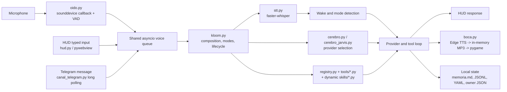
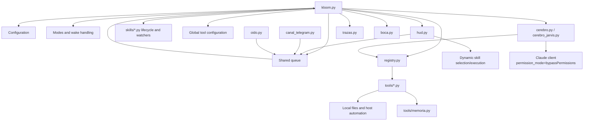
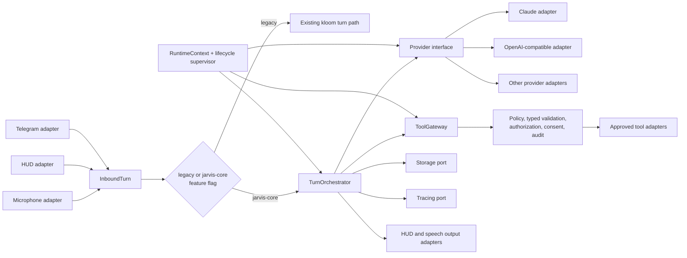

# HARVIS to JARVIS: Phase 0 Current-Architecture Audit

**Decision:** evolve HARVIS incrementally behind stable seams; do not rewrite the runtime. The current system is a local, Python-composed voice assistant with HUD and Telegram inputs, provider-driven LLM/tool turns, local-file persistence, and direct automation capabilities. JARVIS must first isolate turn orchestration, tools, providers, persistence, and lifecycle management while preserving a runnable legacy path.

**Audit status:** static architecture audit based on verified repository evidence. Tests were **not executed** for this audit. This document records what is evidenced, distinguishes retired assumptions, and identifies the smallest reversible migration path.

## Quick Review Path

1. Confirm the verified runtime flow and rejected integration assumptions in [Verified Facts](#verified-facts-and-retired-assumptions).
2. Review the current dependency map and risk register before accepting the component disposition matrix.
3. Use the migration decisions and baseline procedure to begin Phase 1 without tagging the current dirty worktree.

## Phase Objective and Scope

### Objective

Establish the factual HARVIS baseline needed to migrate toward a safer, provider-neutral, testable JARVIS core. Every migration slice must remain runnable and reversible through a feature flag that selects the legacy or JARVIS-core path.

### In scope

- Runtime composition, inbound channels, voice pipeline, HUD, LLM providers, tools, dynamic skills, local persistence, tracing, configuration, and lifecycle ownership.
- Architectural coupling, security and reliability risks, component disposition, migration seams, and baseline safety.
- Documentation of confirmed integrations and explicit rejection of unsupported prior assumptions.

### Out of scope

- Executing tests, startup scripts, external providers, Telegram, or any network operation.
- Reworking source, configuration, dependencies, secrets, tests, or deployment infrastructure.
- Declaring unused code dead without product and runtime evidence.
- Creating a Git tag, committing, staging, stashing, or modifying the existing worktree.
- Selecting a final JARVIS framework, hosted database, or provider vendor.

## Audit Method and Labels

| Label | Meaning in this audit |
|---|---|
| `KEEP` | Retain the capability and its current implementation unless a later focused review identifies a defect. “Candidate” means its behavior still needs product validation. |
| `REFACTOR` | Retain the responsibility, but introduce a boundary, dependency injection, validation, or smaller ownership. |
| `REPLACE` | Retain the responsibility, but replace the implementation because the current safety or reliability mechanism is inadequate. |
| `REMOVE` | Remove only with proof of no runtime and product dependency. |

No component is classified `REMOVE` in Phase 0. In particular, `estrella.py` is product-dependent and is **not proven dead**.

## Verified Facts and Retired Assumptions

### Verified runtime facts

| Area | Verified evidence |
|---|---|
| Runtime composition | `kloom.py` loads configuration, consumes the shared queue, selects modes and providers, and owns tool/watcher lifecycle. It also mutates global tool configuration. |
| User interface | `hud.py` serves embedded HTML/JavaScript through `pywebview`. Typed HUD input joins the same voice queue. |
| Voice input | `oido.py` captures microphone input through a `sounddevice` callback and VAD, then feeds an `asyncio` queue. `stt.py` transcribes with `faster-whisper`. |
| Turn flow | The runtime performs wake/mode detection, enters the provider/tool loop, then sends output to the HUD and `boca.py`. |
| Voice output | `boca.py` uses Edge TTS, keeps MP3 data in memory, and plays it through `pygame`. |
| Telegram | `canal_telegram.py` long-polls the Bot API and admits one owner chat. Telegram messages join the voice queue. |
| LLM providers | `cerebro.py` supports Claude and browser/provider choices `claude`, `ollama`, `groq`, `kimi`, `openai`, and `gemini`. `cerebro_jarvis.py` implements an OpenAI-compatible driver. |
| Tool model | `registry.py` defines tools and adapters. `tools/*.py` supplies Windows, browser, Claude Code, media, timer, memory, homelab, code, project, WhatsApp, vision, and Teams capabilities. |
| Dynamic skills | `skills/*.py` are imported dynamically and may contribute `TOOLS`, `PROMPT`, setup, and `WATCHER` behavior. A HUD-selected skill can be dynamically executed. |
| Persistence and tracing | `tools/memoria.py` writes `memoria.md` and `historial.jsonl`; `trazas.py` writes `turnos.jsonl`. Other local state includes `comandos.yaml` and `telegram_owner.json`. |

### Retired assumptions: not confirmed runtime integrations

| Prior assumption | Audit conclusion | Current evidenced implementation |
|---|---|---|
| OpenRouter | **Not a runtime integration.** Do not describe it as current architecture. | Provider selection is implemented through `cerebro.py` and `cerebro_jarvis.py`. |
| Supabase | **No runtime Supabase integration was found.** | Persistence is local files: Markdown, JSONL, YAML, and owner-state JSON. |
| Web Speech API | **Not a runtime integration.** | STT is `sounddevice` microphone capture plus `faster-whisper`; TTS is Edge TTS to in-memory MP3 plus `pygame`. |

### Known but not verified by this audit

| Topic | Treatment |
|---|---|
| Production traffic, latency, failure rate, and resource use | Not inferred from static evidence. Instrument before setting SLOs or capacity limits. |
| Which dynamic skills and tools are product-critical | Requires product-owner and runtime-usage review. Do not delete based on file presence. |
| `estrella.py` usage | Product-dependent candidate; retain pending evidence. |
| Test behavior | Standalone scripts exist, including `test_startup.py`, `test_registry.py`, and `test_jarvis.py`, but no pytest configuration or dependency was found. No test result is claimed here. |

## Current Runtime Flow

### Flow interpretation

- The shared queue unifies microphone, typed HUD, and Telegram input before orchestration. That reduces channel-specific turn logic but currently couples all ingress to voice-oriented queue semantics.
- `kloom.py` is both composition root and runtime coordinator. It selects modes/providers, manages lifecycle, and configures tools globally, making it the main coupling hub.
- The LLM/tool loop has access to capability registration before a central policy or validation gateway exists.
- HUD and `boca.py` are output adapters but are reached from the existing turn flow rather than through a dedicated response boundary.

## Dependency Map and Coupling

| Coupling point | Current dependency | Why it matters | Migration seam |
|---|---|---|---|
| Composition and turn loop | `kloom.py` owns configuration, queue consumption, providers, tools, watchers, modes, and global tool state. | A change to one runtime concern risks changing startup, turn handling, or tool behavior. | `RuntimeContext`, centralized lifecycle supervision, and `TurnOrchestrator`. |
| Inbound channels | Microphone, HUD text, and Telegram converge on a voice queue. | Channel identity, authentication, and input constraints are not first-class turn data. | `InboundTurn` adapters. |
| Provider selection | `cerebro.py` mixes provider choices and Claude behavior; `cerebro_jarvis.py` is an OpenAI-compatible driver. | Provider-specific capabilities leak into orchestration and tool behavior. | Provider interface with normalized requests, responses, tool calls, errors, and cancellation. |
| Tool registration and execution | `registry.py`, tool modules, and skills are dynamically composed; global configuration is mutated by `kloom.py`. | Tools can be reached without central input validation, authorization, or consistent audit policy. | `ToolGateway` and injected configuration. |
| UI boundary | `hud.py` combines embedded web UI, typed input, and dynamic skill execution. | Presentation and privileged runtime behavior share a boundary. | HUD input/output adapter with no direct execution path. |
| State and tracing | Tools and runtime write local Markdown, JSONL, YAML, and JSON state directly. | File layouts, retention, redaction, and error handling are distributed. | Storage and tracing ports. |

## Component Disposition Matrix

| Component | Evidence | Disposition | Phase 0 decision |
|---|---|---|---|
| Runtime composition and turn loop | `kloom.py` composes config, queues, modes, providers, tool/watcher lifecycle, and global tool configuration. | `REFACTOR` | Split composition from turn handling; inject runtime dependencies rather than mutating globals. |
| HUD boundary | `hud.py` embeds the pywebview UI, adds typed input to the queue, and can dynamically execute HUD-selected skills. | `REFACTOR` | Preserve the HUD experience behind explicit input/output contracts; remove execution authority from the UI boundary. |
| Microphone capture and VAD | `oido.py` uses `sounddevice` callback/VAD and writes to an `asyncio` queue. | `REFACTOR` | Retain capability behind an inbound adapter; add bounded buffering and overload behavior. |
| Speech-to-text | `stt.py` uses `faster-whisper`. | `KEEP` | Retain as the current STT implementation behind an interface; verify cancellation and error behavior in a later slice. |
| Speech output | `boca.py` uses Edge TTS, in-memory MP3, and `pygame`. | `KEEP` candidate | Keep the local output capability; product review should confirm UX, failure handling, and concurrency requirements. |
| Telegram ingress | `canal_telegram.py` long-polls and uses first-contact ownership pairing. | `REFACTOR` | Retain the channel but replace pairing semantics with explicit enrollment and identity checks. |
| Provider selection | `cerebro.py` supports Claude, Ollama, Groq, Kimi, OpenAI, and Gemini choices. | `REFACTOR` | Extract a provider-neutral interface; do not treat unsupported external services as current integrations. |
| OpenAI-compatible driver | `cerebro_jarvis.py` provides that driver. | `REFACTOR` | Preserve the driver as a provider adapter after request/response normalization. |
| Registry concept | `registry.py` defines tools and adapters but lacks validation and policy enforcement. | `REFACTOR` | Keep the provider-neutral registry concept; redesign its implementation around a gateway. |
| Tool modules | `tools/windows.py`, `browser.py`, `claude_code.py`, `media.py`, `timers.py`, `memoria.py`, `homelab.py`, `codigo.py`, `proyectos.py`, `whatsapp.py`, `vision.py`, and `teams.py`. | `REFACTOR` | Preserve capabilities only behind typed input, risk classification, authorization, consent, and audit controls. |
| SSH command filtering | `tools/homelab.py` handles model-provided SSH commands with a regex denylist. | `REPLACE` | Replace denylist filtering with operation allowlists enforced by the policy gateway. |
| Dynamic skills | `skills/*.py` may add tools, prompt, setup, and watchers; HUD can select a skill for dynamic execution. | `REFACTOR` | Treat skills as reviewed extensions with declared capabilities, lifecycle limits, and no UI-granted execution authority. |
| Local memory | `tools/memoria.py` writes `memoria.md` and `historial.jsonl`. | `REFACTOR` | Keep local persistence as an initial implementation behind a storage port; define retention, redaction, and concurrency policy. |
| Tracing | `trazas.py` writes `turnos.jsonl`. | `REFACTOR` | Preserve trace value behind a tracing port with structured, redacted events. |
| Other local state | `comandos.yaml` and `telegram_owner.json`. | `REFACTOR` | Put ownership and command state behind storage abstractions and validation. |
| Diagnostics | `doctor.py`. | `KEEP` candidate | Preserve as a diagnostics foundation after confirming its operational contracts. |
| Fingerprint capability | `huella.py`. | `KEEP` candidate | Preserve pending product and security review. |
| Product-dependent module | `estrella.py`. | `KEEP` candidate | Not proven unused; do not classify as `REMOVE` until product dependency and runtime use are assessed. |
| OpenRouter, Supabase, Web Speech API | No runtime evidence found. | `REMOVE` from architecture assumptions | Remove these from current-state diagrams and claims, not from source code. |

## Risk Register

### Security

| Severity | Risk | Evidence | Required migration control |
|---|---|---|---|
| Critical | Model-provided SSH commands rely on a regex denylist, which is not a safe authorization model. | `tools/homelab.py`. | Replace with a policy gateway using explicit operation and target allowlists, typed arguments, and audited execution. |
| High | Claude is configured with `permission_mode="bypassPermissions"`, eliminating a provider-level permission barrier. | `cerebro.py`. | Make JARVIS policy enforcement provider-independent; remove reliance on bypassed provider permission controls. |
| High | Tool registry and adapters lack input validation and policy enforcement. | `registry.py`. | Validate typed inputs; authorize per tool/operation; classify side effects before dispatch. |
| High | Direct automation and paste tools can cause host or third-party side effects. | `tools/*.py` automation capabilities. | Route all effects through `ToolGateway`, with idempotency where possible and transaction-bound consent for sensitive actions. |
| High | HUD-selected skills can execute dynamically. | `hud.py`; dynamic `skills/*.py` imports. | Require reviewed manifests and server-side authorization; never let UI selection grant execution authority. |
| High | Confirmations are prompt-only and are not bound to an exact operation. | Current provider/tool loop behavior. | Use transaction-bound consent that records actor, exact proposed action, parameters, expiry, and one-time approval. |
| Medium | Telegram first-contact pairing can assign ownership based on first contact. | `canal_telegram.py`; `telegram_owner.json`. | Require explicit enrollment/bootstrap secret or local approval before granting owner authority. |
| Medium | Local command and reply logs may contain sensitive, unredacted content. | `historial.jsonl`, `turnos.jsonl`, and local command state. | Define redaction, access control, retention, and secure export policies through tracing/storage ports. |

### Reliability and operability

| Severity | Risk | Evidence | Required migration control |
|---|---|---|---|
| High | `oido.py` may accumulate an unbounded queue or audio buffer under backpressure. | `sounddevice` callback/VAD feeding the shared `asyncio` queue. | Bound queues, define drop/backpressure behavior, and expose queue depth telemetry. |
| High | `kloom.py` combines composition, lifecycle, global configuration, and turn processing. | Verified runtime responsibilities in `kloom.py`. | Separate lifecycle supervision, immutable/injected context, and orchestrator ownership. |
| Medium | Dynamic skills may add setup and watcher behavior without centralized supervision. | `skills/*.py` can contribute setup and `WATCHER`; `kloom.py` owns lifecycle. | Centralize startup/shutdown, error isolation, and watcher cancellation. |
| Medium | Requirements are unpinned. | Dependency baseline audit finding. | Pin and review requirements before declaring a reproducible baseline. |
| Medium | Test scripts are standalone and may be side-effectful; media fixtures are missing. | `test_startup.py`, `test_registry.py`, `test_jarvis.py`, related scripts; no pytest config/dependency found. | Classify scripts, isolate effects, supply fixtures, and establish a deterministic test runner. |

## Explicit Migration Decisions

| Decision | Rationale | Reversibility |
|---|---|---|
| Introduce `InboundTurn` adapters for microphone, HUD text, and Telegram. | Preserve current channels while carrying channel identity, origin, and input metadata explicitly. | Each adapter can continue submitting to the legacy path. |
| Place a `TurnOrchestrator` facade in front of the current loop. | Shrinks `kloom.py` without changing all providers and tools at once. | Feature flag routes a turn to legacy or JARVIS-core orchestration. |
| Add a `ToolGateway` before all effectful tools. | Central location for schema validation, authorization, policy, consent, audit, timeout, and cancellation. | Start in observe/compatibility mode, then enable enforcement per tool class. |
| Extract a provider interface. | Normalizes provider differences across Claude, OpenAI-compatible, local, and browser/provider choices. | Existing `cerebro.py` and `cerebro_jarvis.py` become adapters. |
| Introduce storage and tracing ports. | Keeps local files operational while centralizing retention, redaction, and consistency policy. | File-backed implementations remain the first adapters. |
| Inject `RuntimeContext`; stop global tool configuration mutation. | Makes runtime dependencies explicit and testable. | Legacy globals can be wrapped temporarily at the composition boundary. |
| Centralize lifecycle supervision. | Gives skills, watchers, audio, and providers managed startup, shutdown, cancellation, and failure isolation. | Supervise legacy components before replacing them. |
| Replace denylist SSH control and prompt-only consent. | Negative matching and conversational confirmation cannot provide bounded authorization. | Roll out by operation class with legacy path available behind the feature flag. |
| Prefer service APIs over UI/coordinate automation where available. | APIs are more deterministic, observable, and controllable. | Retain automation only where no suitable API exists and apply gateway policy. |

## Target Migration Shape

### Incremental sequence

1. Make the baseline reproducible and safe to identify; do not tag the current dirty worktree.
2. Wrap the three inbound paths as `InboundTurn` adapters while delegating unchanged behavior to the legacy path.
3. Introduce `TurnOrchestrator` as a facade and protect the route with a legacy-versus-core feature flag.
4. Route tools through a compatibility-mode `ToolGateway`; log proposed policy decisions before enforcing them.
5. Extract provider adapters and move provider selection out of turn orchestration.
6. Move local memory and tracing behind ports without migrating data storage yet.
7. Inject `RuntimeContext`, centralize lifecycle supervision, and remove global configuration mutation only after equivalent behavior is covered.
8. Enforce operation allowlists and transaction-bound consent for side effects, rolling out tool classes incrementally.

## Safe Baseline and Tag Procedure

### Current baseline facts

- Branch: `main`, tracking `origin/main`.
- Existing worktree changes: modified `kloom.py` and `stt.py`; added `test_startup.py`; untracked `.codegraph/` and `docs/jarvis/`.
- `harvis-stable` was not found.
- Tests were not run for this architecture audit.

### Required procedure

A stable tag **cannot be created safely now**. First review the unrelated modifications and either commit them as intentional work or stash them; run the agreed validation; then select the exact baseline commit. A tag identifies a commit, not a mutable working directory, so tagging before those steps would make the “stable” label ambiguous and unauditable.

1. Review each existing modification and untracked path; preserve intentional work in scoped commits or stash it outside the baseline decision.
2. Establish a clean worktree and select the exact commit that represents the intended HARVIS baseline.
3. Pin and review requirements, then run the agreed deterministic startup and standalone test-script validation in an isolated environment. Record commands and results; this audit does not claim them.
4. Verify the selected commit and working tree state with `git status --short`, `git rev-parse HEAD`, and the project’s chosen validation evidence.
5. Create an annotated `harvis-stable` tag only after steps 1-4 pass, and verify the tag resolves to the chosen commit. Distribution of the tag is a separate, explicitly approved operation.

## Phase 0 Acceptance Checklist

- [x] The document states the Phase 0 objective, scope, and exclusions.
- [x] Current runtime composition, input paths, voice pipeline, providers, tooling, persistence, and outputs are documented from verified evidence.
- [x] Mermaid diagrams show both the current flow and the target incremental migration shape.
- [x] OpenRouter, Supabase, and Web Speech API are explicitly recorded as non-runtime integrations.
- [x] The dependency map identifies `kloom.py`, the shared queue, provider selection, registry/tools, dynamic skills, HUD, and local storage coupling.
- [x] The component matrix uses `KEEP`, `REFACTOR`, `REPLACE`, and `REMOVE` labels with evidence; no source component is declared removable without proof.
- [x] Security and reliability risks include severity, evidence, and migration controls.
- [x] The migration plan includes `InboundTurn`, `TurnOrchestrator`, `ToolGateway`, provider interface, storage/tracing ports, `RuntimeContext`, lifecycle supervision, and a legacy/core feature flag.
- [x] The baseline procedure explains why a stable tag cannot safely be created until existing modifications are handled, validation passes, and a baseline commit is selected.
- [x] The audit does not claim test execution or results.

## Phase 1 Entry Criteria

Begin implementation only after a baseline commit is selected and a feature-flagged first slice has an explicit rollback path. The preferred first slice is an `InboundTurn` plus `TurnOrchestrator` facade that delegates to the existing turn loop; it changes ownership boundaries without changing provider or tool behavior.
