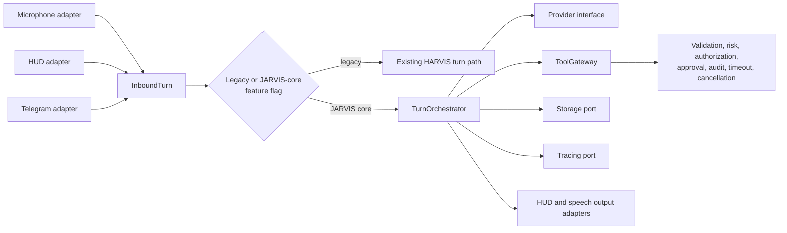

# JARVIS Target Boundaries

JARVIS is a proposed set of runtime boundaries for evolving HARVIS safely. Phase 0 selects these boundaries and an incremental path; it does not select a framework, database, provider, deployment model, or JavaScript source layout.

## Target Shape

## Boundary Contracts

| Boundary | Responsibility | Initial migration treatment |
|---|---|---|
| `InboundTurn` | Represent microphone, HUD-text, and Telegram input with origin and identity metadata. | Adapters delegate to the legacy path first. |
| `TurnOrchestrator` | Coordinate a turn without owning composition, global configuration, or channel-specific behavior. | A facade preserves existing turn behavior. |
| Provider interface | Normalize requests, responses, tool calls, errors, and cancellation. | Wrap current Claude and OpenAI-compatible paths. |
| `ToolGateway` | Validate typed input, assign risk, authorize, bind approval, audit, time-limit, and cancel tool execution. | Start in compatibility/observation mode before enforcement by tool class. |
| Storage and tracing ports | Isolate local state, retention, redaction, and event recording. | Keep file-backed behavior initially. |
| Output adapters | Deliver responses to the existing pywebview HUD and Edge TTS/`pygame` path. | Preserve the current user experience. |
| Runtime context and lifecycle supervision | Make dependencies explicit and own startup, shutdown, watcher cancellation, and failure isolation. | Wrap existing components before changing behavior. |

## Current Adapters

The initial adapters preserve proven runtime capabilities:

| Capability | Current implementation | Boundary direction |
|---|---|---|
| Voice input | `sounddevice` -> VAD -> `asyncio` queue -> `faster-whisper` | Microphone `InboundTurn` adapter |
| HUD | `pywebview` with embedded HTML/JavaScript | HUD input/output adapters |
| Telegram | Bot API long polling | Telegram `InboundTurn` adapter with enrollment controls |
| Providers | Claude, Ollama, Groq, Kimi, OpenAI, Gemini through `cerebro.py` / `cerebro_jarvis.py` | Provider adapters |
| Speech output | Edge TTS -> in-memory MP3 -> `pygame` | Speech output adapter |
| State and traces | Local Markdown, JSONL, YAML, and JSON files | Storage and tracing ports |

## Architecture Invariants

- The legacy path and JARVIS-core path are selectable per feature flag and have a rollback path.
- The HUD may request input or display output but never grants dynamic skill execution authority.
- All effectful tools cross `ToolGateway`; no model, UI, or provider bypasses policy.
- Provider choice remains replaceable. Current runtime providers are supported through adapters, not hard-wired into orchestration.
- Local files remain valid initial storage adapters. No database is selected in Phase 0.
- OpenRouter, Supabase, and Web Speech API are not current integrations. Future evaluation requires an explicit decision and migration slice.

## First Slice

Implement only the three `InboundTurn` adapters and a `TurnOrchestrator` facade that delegates unchanged behavior to the existing HARVIS turn loop. Keep providers, tools, persistence, and output implementations on the legacy route until their focused slices are ready.
